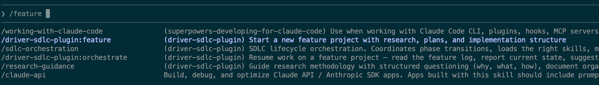

# drvr — SDLC Plugin for Claude Code

A Claude Code plugin (drvr) that guides structured feature development through a full software development lifecycle. Features move through Research, Planning, Validation, Implementation, Review, and Handoff phases -- each supported by specialized skills, commands, and agents that keep work organized, traceable, and thorough.

## Prerequisites

- [Claude Code](https://docs.anthropic.com/en/docs/claude-code) installed and configured
- A [Driver](https://driverai.com) account with your codebases onboarded
- `python3` available in PATH — required for the laziness detector hook

## Installation

Clone the repository:

```bash
git clone https://github.com/driver-ai/driver-sdlc-plugin.git
```

Add the plugin as a marketplace source, then install:

```bash
claude plugin marketplace add /path/to/driver-sdlc-plugin
claude plugin install drvr
```

Or load it for a single session:

```bash
claude --plugin-dir /path/to/driver-sdlc-plugin --permission-mode auto
```

## Getting Started

> **Note:** This plugin orchestrates many tools, agents, and file operations across its lifecycle phases. For the best experience, run Claude Code with `--permission-mode auto`, which approves routine tool calls automatically while still flagging unusual operations:
>
> ```bash
> claude --permission-mode auto
> ```
>
> See the [Claude Code permissions documentation](https://docs.anthropic.com/en/docs/claude-code/security) for details on permission modes.

After installing the plugin, run `/drvr:setup` to configure your projects directory. It handles everything: creating the directory structure, generating CLAUDE.md, configuring the Driver MCP server, and verifying connectivity.

### New Team / Solo Developer

1. Open Claude Code with `--permission-mode auto`
2. Run `/drvr:setup` — it will guide you through creating a projects directory with all required configuration

### Joining an Existing Team

1. Clone your team's projects repo: `git clone <team-repo-url>`
2. Open Claude Code in the cloned directory with `--permission-mode auto`
3. Run `/drvr:setup` — it will verify your configuration and fill any gaps

You can also pass a clone URL directly: `/drvr:setup git@github.com:my-org/my-team-sdlc.git`

> **Note:** `/drvr:setup` is idempotent — safe to re-run at any time. It also creates `.mcp.json` locally (gitignored, since it may contain API keys), so each team member needs to run `/drvr:setup` on their own machine.

### Verify

After setup, run `/drvr:feature my-first-feature` to confirm everything works.

## Why a Projects Repo?

The drvr plugin works from a dedicated projects repository — separate from your source code. This repo tracks the *process* of building software: research, plans, decisions, and implementation logs.

- **Version-controlled thinking** — every decision is a git commit you can trace back to
- **Queryable artifacts** — YAML frontmatter lets you filter and aggregate project state
- **Agent-accessible context** — plans and research docs become instruction sets that agents follow during implementation

The drvr plugin generates most artifacts through guided workflows. Your job is to provide the thinking; the plugin handles the structure.

## SDLC Workflow

```
/drvr:feature --> Research --> Planning --> Validation --> Materialization --> Implementation --> Review --> Bookkeeping --> Next Plan --> ...
                                                                                                                                |
                                                                                                                   All plans complete
                                                                                                                                |
                                                                                                                                v
                                                                                                        /drvr:assess --> /drvr:docs-artifacts --> Ship
```

### Phase Descriptions

| Phase | What Happens |
|-------|-------------|
| **Research** | Explore the problem space using structured Why-What-How questioning. Produce research docs and design decisions. |
| **Planning** | Write implementation plans with TDD-first task ordering, test strategy, and explicit constraints. |
| **Validation** | Dry-run each plan to find gaps before writing code. All gaps are reviewed, classified by severity. |
| **Materialization** | Approved plan tasks are converted into standalone task documents. Each embeds codebase root, file paths, standards, and instructions for sub-agent execution. |
| **Implementation** | Execute materialized task documents. Track deviations from the plan. Commit after each task. |
| **Review** | Present deviations for approval. Run cascade checks against downstream plans. |
| **Bookkeeping** | Update plan statuses, overview progress, and feature log. |
| **Assessment** | Curate the test suite -- prune scaffolding tests, promote valuable ones. |
| **Handoff** | Generate feature overview, architecture, testing guide, and risk assessment docs. |

The drvr plugin is intentionally front-loaded: most time goes into Research and Planning. Implementation should be mechanical -- executing a well-validated plan.

## Usage Scenarios

### Easy: Understanding a Codebase

Use `/drvr:context` to get oriented in an unfamiliar codebase before making changes.

```
/drvr:context How does the authentication flow work? --codebases my-backend
```

The drvr plugin spawns an agent that reads Driver's architecture docs and code maps, then returns a synthesized summary without cluttering your conversation context.

### Easy: Bug Fix with Context

Gather targeted context before fixing a bug.

```
/drvr:context The user profile page crashes when email is null --codebases frontend
```

Review the returned context, fix the bug, and commit. No full SDLC needed for a straightforward fix.

### Easy: Session Retrospective

Reflect on what happened in the current session and capture improvements.

```
/drvr:retro
> (analyzes session: what phase you were in, what was accomplished, friction events)
> (evaluates work quality, identifies patterns from prior retros)
> "write it"
> (retro saved to retrospectives/ with actionable improvements)
```

### Medium: Single-Plan Feature End-to-End

Build a complete feature through all phases, from research through approval, materialization, and handoff.

```
/drvr:feature add-export-csv
> (research phase: answer questions about requirements, explore options)
> "ready to plan"
> (planning phase: review the generated plan, adjust tasks)
/drvr:dry-run-plan 01-export-logic
> (fix any gaps found, re-run if needed)
> "approve plan 01"
> (plan approved — tasks materialize into standalone task docs)
> "let's implement"
> (implementation: tasks executed from materialized docs, tests written, code committed)
> (deviations reviewed, bookkeeping updates plan status)
/drvr:assess features/add-export-csv
> (curate test suite — prune scaffolding, promote valuable tests, keep durable ones)
/drvr:docs-artifacts features/add-export-csv
> (generates: feature-overview, architecture, testing-guide, risk-assessment)
> Ready for PR review
```

### Medium: Bug Investigation with SDLC

Use the structured approach for complex bugs that need root-cause analysis.

```
/drvr:feature investigate-race-condition
> (research phase: document symptoms, reproduce conditions, identify root cause)
> "ready to plan"
> (plan the fix with regression tests)
/drvr:dry-run-plan 01-fix-race-condition
> "approve plan 01"
> (tasks materialize)
> "let's implement"
> (fix applied, regression tests pass)
/drvr:assess features/investigate-race-condition
/drvr:docs-artifacts features/investigate-race-condition
```

### Advanced: Multi-Plan Feature with Dependencies

Coordinate backend and frontend work with dependency ordering.

```
/drvr:feature support-ticket-system
> (research produces decisions on API design, data model, UI approach)
> "ready to plan"
> (create plans: 01-data-model, 02-api-endpoints, 03-frontend-ui)
> (overview tracks dependencies: 03 depends on 02, 02 depends on 01)
/drvr:dry-run-plan 01-data-model
> "approve plan 01"
> (tasks materialize)
> "let's implement"
> (complete plan 01, deviations reviewed, bookkeeping updates overview)
> "what's next"
> (orchestration identifies 02-api-endpoints as next unblocked plan)
> (repeat: dry-run → approve → materialize → implement for each plan)
/drvr:assess features/support-ticket-system
/drvr:docs-artifacts features/support-ticket-system
```

### Advanced: Cross-Session Feature Development

Resume work after closing a session.

```
/drvr:orchestrate features/support-ticket-system
> Plugin reads the feature log, reports: "Plan 01 complete, Plan 02 in progress, task 3 of 7 done"
> "continue implementing"
```

### Expert: Large Feature with 4+ Plans

Full orchestration at scale with multiple plans and dependency management.

```
/drvr:feature data-pipeline-migration
> (extensive research: 10+ research docs, 15+ decisions)
> (planning: 5 plans with dependency graph in 00-overview.md)
/drvr:dry-run-plan 01-schema-design
/drvr:dry-run-plan 02-api-layer
> (validate all plans before implementing any)
> "approve plan 01"
> (tasks materialize, implement plan 01)
> (deviations reviewed — cascade-check verifies no impact on downstream plans)
> (bookkeeping, next plan)
> (repeat for each plan in dependency order)
/drvr:assess features/data-pipeline-migration
> (curate tests across all plans — prune, promote, keep)
/drvr:docs-artifacts features/data-pipeline-migration
> (handoff docs generated for PR review)
```

### Expert: Dry-Run Driven Development

For high-stakes features, run every plan through validation before writing any code.

```
/drvr:feature payment-processing
> (research phase with security focus)
> (plan all components)
/drvr:dry-run-plan 01-payment-models
/drvr:dry-run-plan 02-stripe-integration
/drvr:dry-run-plan 03-webhook-handlers
/drvr:dry-run-plan 04-refund-flow
> (fix all identified gaps across all plans)
> "approve plan 01"
> (materialize and implement each plan in sequence)
> (cascade-check after each plan ensures no downstream breakage)
/drvr:assess features/payment-processing
/drvr:docs-artifacts features/payment-processing
```

## Commands Reference

| Command | Description | Example |
|---------|-------------|---------|
| `/drvr:setup [clone-url]` | Set up a projects directory -- configure MCP, create structure, verify connectivity | `/drvr:setup` or `/drvr:setup git@github.com:my-org/sdlc.git` |
| `/drvr:feature <name>` | Scaffold a new feature project with research, plans, and implementation structure | `/drvr:feature user-notifications` |
| `/drvr:orchestrate <path>` | Resume work on a feature -- read the feature log, report current state, suggest next action | `/drvr:orchestrate features/user-notifications` |
| `/drvr:dry-run-plan <plan>` | Walk through a plan as-if implementing to identify gaps before real implementation | `/drvr:dry-run-plan 02-api-endpoints` |
| `/drvr:assess` | Curate the test suite after implementation -- categorize, prune scaffolding, promote valuable tests | `/drvr:assess features/user-notifications` |
| `/drvr:docs-artifacts <path>` | Generate handoff docs (overview, architecture, testing guide, risk assessment) for code review | `/drvr:docs-artifacts features/user-notifications` |
| `/drvr:context <task>` | Gather codebase context for a specific task via Driver | `/drvr:context How does the billing module work? --codebases backend` |
| `/drvr:retro` | Analyze the current session -- evaluate work quality, identify improvements, think about what is next | `/drvr:retro --write` |

## Skills

Skills activate automatically based on the current SDLC phase or trigger phrases. They provide methodology guidance and enforce workflow discipline.

| Skill | What It Does | When It Activates |
|-------|-------------|-------------------|
| **research-guidance** | Structured Why-What-How questioning, document organization, and research completion criteria. | Trigger phrases: "let's research", "investigate", "explore", "understand how", "what's the best approach" |
| **planning-guidance** | TDD-first task design, test strategy, architecture fit, explicit constraints, and task breakdown. Plans are always written to files, never in chat. | Trigger phrases: "let's plan", "ready to plan", "create a plan", "test strategy", "TDD" |
| **implementation-guidance** | Plan-driven task execution, subagent delegation for context gathering, deviation tracking, and commit discipline. | Trigger phrases: "let's implement", "start implementing", "ready to build", "execute the plan" |
| **materialize-tasks** | Converts approved plan tasks into standalone task docs for sub-agent execution. Validates dry-run gaps, resolves codebase target, embeds standards. | Trigger phrases: "materialize tasks", "materialize tasks for plan X", "re-materialize", "create task docs" |
| **sdlc-orchestration** | Coordinates phase transitions, loads the right skills, manages bookkeeping, and handles session resumption. | Trigger phrases: "where are we", "what's next", "resume feature", "feature status" |

## Agents

Agents are specialized workers that run in isolated context. They are spawned by skills or commands -- you can also invoke them directly via the Agent tool.

| Agent | What It Does |
|-------|-------------|
| **driver-task-context** | Gathers targeted codebase context from Driver MCP in an isolated sandbox. Reads architecture docs, explores code maps, and returns synthesized context without burdening your main conversation. |
| **handoff-analyzer** | Orchestrates handoff documentation generation. Coordinates the extraction agents below and synthesizes their outputs into final handoff artifacts. |
| **commit-log** | Extracts detailed commit history for a feature branch -- messages, files changed, diff statistics, and patterns. |
| **decisions-log** | Extracts all design decisions from research docs and plans, producing a comprehensive decisions log in ADR format. |
| **features-list** | Catalogs all capabilities added in a feature branch -- user-facing features, API changes, configuration options, and internal capabilities. |
| **security-review** | Analyzes code changes for security concerns -- authentication, authorization, input validation, secrets handling, and common vulnerabilities. |
| **test-coverage** | Maps tests to implementation, identifies coverage gaps, and catalogs test types (unit, integration, end-to-end). |
| **dependency-analysis** | Reviews dependency changes -- new packages, version changes, license compliance, and known vulnerabilities. |
| **cascade-check** | Checks whether implementation deviations need to cascade to downstream plans. Classifies each cascade as informational or design-impact. |

## Hooks

Hooks are automatically registered when the plugin is installed via `hooks/hooks.json` — no manual configuration needed.

### laziness-detector (PreToolUse)

Blocks Write and Edit operations that contain lazy code patterns: TODO/FIXME comments, `NotImplementedError`, empty function bodies, placeholder returns, and similar stubs across Python, TypeScript, JavaScript, Swift, Go, Java, and C#. Test files are excluded.

### track-skill-load (PreToolUse)

Tracks which skills are loaded during a session by appending skill names to a session-scoped temp file. Used for phase tracking and observability during retrospectives.

Both hooks resolve their configuration via the `CLAUDE_PLUGIN_ROOT` environment variable (set by Claude Code) with a fallback to relative path resolution for backward compatibility. They follow a fail-open pattern — errors never block user operations.

## Friction Tracking

Observational friction logging -- detects wrong-tool usage, wrong-path edits, and laziness blocks during sessions.

- **Enable**: Set `"friction_tracking": true` in `~/.driver/config.json`
- **Data**: Events logged to `/tmp/driver-friction-{SESSION_ID}.log` in JSONL format
- **Review**: Run `/drvr:retro` -- the Friction Events section summarizes session friction
- **Reference**: See `hooks/friction-taxonomy.md` for the full taxonomy

## Customization

There are two levels of customization:

- **Team standards** (recommended): Edit the `CLAUDE.md` in your projects repo (generated by `/drvr:setup`) to add coding standards, naming conventions, testing strategy, and engineering guidelines. The plugin discovers and enforces these during research, planning, and implementation.
- **Plugin behavior**: Fork the plugin to customize hooks, skill trigger phrases, or agent model preferences in agent markdown frontmatter.

## Troubleshooting

**MCP connection failures**
- Run `/drvr:setup` -- it verifies MCP connectivity and reports issues
- Verify your Driver API token is valid and configured in Claude Code
- Check network connectivity to Driver's API
- Confirm your codebases are onboarded in Driver -- use `get_codebase_names` to verify
- The MCP server **must** be named `driver-mcp` -- all plugin agents reference tools using the `mcp__driver-mcp__` prefix. Using a different name will cause agent failures.

**Rate limits**
- Wait and retry. Driver MCP calls have rate limits.
- Reduce parallel agent invocations if you hit limits frequently

**File path errors**
- Use Glob to verify file paths before editing
- Ensure your feature directory exists and follows the expected structure

**Session resumption**
- Use `/drvr:orchestrate <feature-path>` to pick up where you left off
- The drvr plugin reads `FEATURE_LOG.md` to determine current state and suggest next actions

## Key Gotchas

- **Driver shows committed state, not local changes.** Uncommitted code will not appear in Driver's documentation. Commit your work before querying Driver for updated context.
- **Codebase names must match exactly.** Use `get_codebase_names` via Driver MCP to verify the exact name before passing it to tools.
- **Large Driver responses should go through the agent.** Calling Driver MCP directly for architecture overviews or onboarding guides can consume significant context. Route these through `driver-task-context` instead.
- **Plans are the source of truth during implementation.** The drvr plugin enforces plan-driven development. Deviations are tracked, not prevented, but they must be reviewed before bookkeeping proceeds.
- **The laziness detector skips test files.** Patterns like TODO and NotImplementedError in test files are intentionally allowed.
- **`.mcp.json` is gitignored.** It may contain API keys, so `/drvr:setup` creates it locally but does not commit it. Each team member needs to run `/drvr:setup` on their own machine to get their local `.mcp.json`.
- **Select the correct command when multiple plugins are installed.** For example, typing `/drvr:feature` in Claude Code may match commands from other plugins — make sure to select the one with the full name `drvr:feature` in the list below. Here's a screenshot that shows an example:


